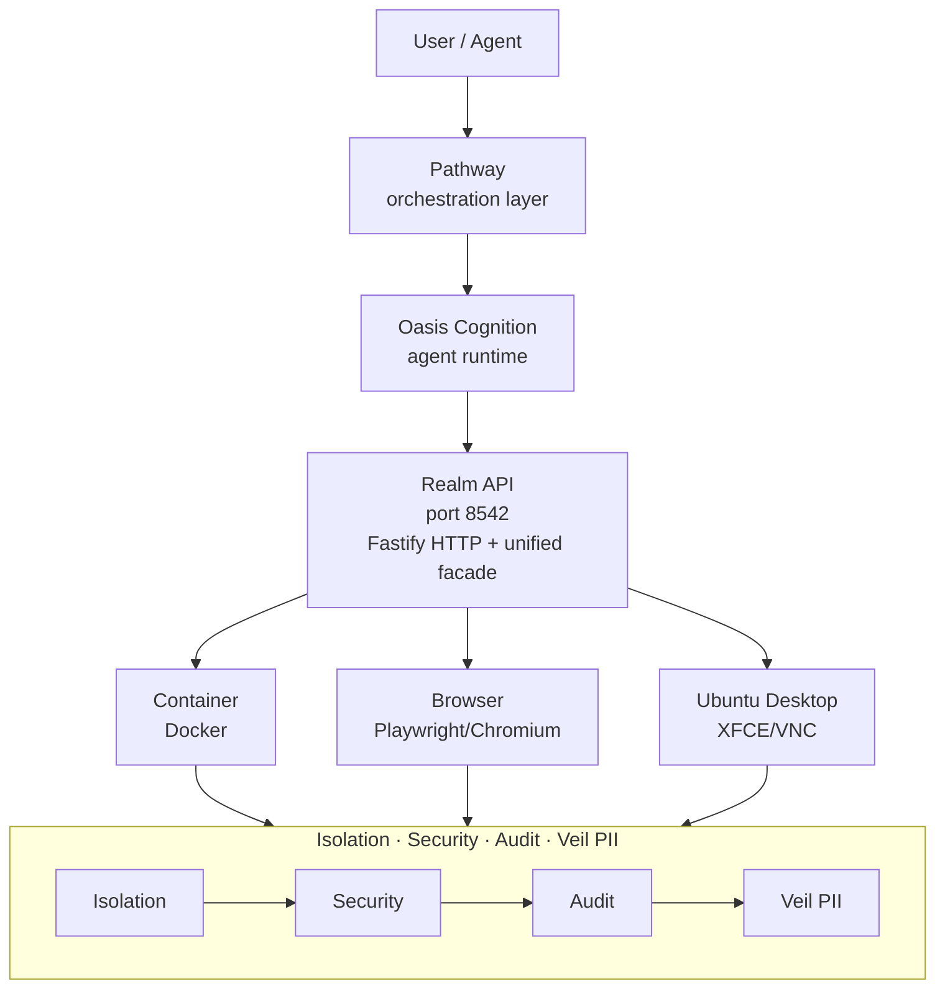

<div align="center">
  
  <h1>Realm</h1>
  <p><strong>A world built for agents.</strong></p>
</div>

<div align="center">
  <a href="https://github.com/theaiinc/realm"></a>
  <a href="https://www.npmjs.com/package/@theaiinc/realm-core"></a>
  <a href="https://github.com/theaiinc/realm/blob/main/LICENSE"></a>
  <a href="https://www.typescriptlang.org/"></a>
  <a href="https://pnpm.io/"></a>
  <a href="CONTRIBUTION_GUIDELINES.md"></a>
</div>

Realm is an isolated AI execution environment platform. Agents interact with a universal API and never know which engine (Container, Browser, Ubuntu Desktop, or VM) is executing their task.

## Architecture



## Packages

| Package                                                 | Version | Description                                                                      |
| ------------------------------------------------------- | ------- | -------------------------------------------------------------------------------- |
| [`@theaiinc/realm-core`](packages/realm-core)           | `0.2.0` | Core abstractions, types, and API facade — the universal engine interface        |
| [`@theaiinc/realm-container`](packages/realm-container) | `0.1.1` | Docker-based container engine with filesystem, network, and lifecycle management |
| [`@theaiinc/realm-browser`](packages/realm-browser)     | `0.1.1` | Playwright/Chromium browser engine for web automation                            |
| [`@theaiinc/realm-ubuntu`](packages/realm-ubuntu)       | `0.1.1` | Ubuntu Desktop engine with XFCE4, VNC, Chromium, and embedded Ratatoskr daemon   |
| [`@theaiinc/realm-cli`](packages/realm-cli)             | `0.1.1` | CLI client for managing realms from the terminal                                 |
| [`@theaiinc/realm-api`](packages/realm-api)             | `0.2.0` | Fastify REST API server exposing all realm operations                            |
| [`@theaiinc/realm-veil`](packages/realm-veil)           | `0.1.1` | Veil PII redaction integration for secure agent outputs                          |
| `@theaiinc/realm-vm`                                    | —       | Apple Virtualization Framework engine _(in development)_                         |

## Quick Start

```bash
# Install dependencies
pnpm install

# Build all packages
pnpm build

# Start the Realm API server
pnpm realm:api

# In another terminal, create a realm
pnpm realm create --name my-realm --engine container

# Start it
pnpm realm start <realm-id>

# Execute a command
pnpm realm exec <realm-id> -- echo "hello from realm"

# Stop and destroy
pnpm realm stop <realm-id>
pnpm realm destroy <realm-id>
```

## API Endpoints

| Method | Path                         | Description          |
| ------ | ---------------------------- | -------------------- |
| GET    | `/api/v1/health`             | Health check         |
| GET    | `/api/v1/realms`             | List all realms      |
| POST   | `/api/v1/realms`             | Create a realm       |
| GET    | `/api/v1/realms/:id`         | Get realm details    |
| POST   | `/api/v1/realms/:id/start`   | Start a realm        |
| POST   | `/api/v1/realms/:id/stop`    | Stop a realm         |
| DELETE | `/api/v1/realms/:id`         | Destroy a realm      |
| GET    | `/api/v1/realms/:id/capture` | Capture screenshot   |
| POST   | `/api/v1/realms/:id/click`   | Click at coordinates |
| POST   | `/api/v1/realms/:id/type`    | Type text            |
| POST   | `/api/v1/realms/:id/exec`    | Execute command      |
| POST   | `/api/v1/realms/:id/import`  | Import file          |
| POST   | `/api/v1/realms/:id/export`  | Export file          |
| GET    | `/api/v1/audit`              | Get audit log        |

## Security Model

**Default deny** — nothing is accessible unless explicitly granted:

- **Internet access** — disabled / restricted / full
- **File import** — copied, not mounted directly
- **File export** — requires user approval
- **Clipboard** — needs explicit permission
- **Shared folder** — read-only / read-write / disabled

## Veil Integration

All outbound data (screenshots, documents, logs, reports) passes through Veil PII detection before reaching the agent or being exported.

Detected PII types:

- Email addresses
- Phone numbers
- Credit card numbers
- Passport numbers
- API keys and secrets
- Access tokens
- Names

## Ubuntu Desktop Engine

The [`@theaiinc/realm-ubuntu`](packages/realm-ubuntu) package provides a full Ubuntu Desktop environment designed for AI agent computer-use tasks:

- **XFCE4 desktop** with Xvfb virtual display and x11vnc remote access
- **Chromium browser** with pre-installed Oasis Chrome Bridge extension
- **Embedded Ratatoskr daemon** for Yggdrasil orchestration
- **xdotool + ImageMagick** for input simulation and screenshot capture
- Pre-installed with Node.js 22, Python 3, Git, GitHub CLI, and more

```bash
cd packages/realm-ubuntu
pnpm build:docker

docker run -d \
  --name my-realm \
  -p 5901:5901 \
  -e YGGDRASIL_URL=http://host.docker.internal:3000 \
  realm-ubuntu

# Connect via VNC: open vnc://localhost:5901
```

## Test Suite

```bash
pnpm test
```

| Package           | Tests  |
| ----------------- | ------ |
| `realm-core`      | 20     |
| `realm-container` | 10     |
| `realm-browser`   | 13     |
| `realm-veil`      | 8      |
| `realm-ubuntu`    | 6      |
| **Total**         | **57** |

## License

[MIT](LICENSE)
